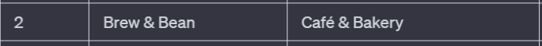

# Guided Assignment: Linear Search

## Introduction

Linear search, also known as sequential search, is one of the simplest searching algorithms. This tutorial explains linear search in detail, including its mechanism, applications, and examples in C#.

### What is Linear Search?

Linear search is a method for finding a particular value in a list by checking each element sequentially until the desired value is found or the list ends. It's straightforward and doesn't require the list to be sorted.

### How a Linear Search Works

1. Start at the first element.
2. Open the box and check if it contains the item you're looking for.
3. If it matches, either return the result or save it in a collection.
4. If not, move on to the next element.
5. Repeat steps 2-4 until you either find the item or reach the end of the list.


### Advantages and Disadvantages

- **Advantages:**
  - Simplicity: Easy to understand and implement.
  - No need for a sorted list: Works on unsorted data.

- **Disadvantages:**
  - Efficiency: Not suitable for large datasets as it checks each element one by one.
  - Time-Consuming: The time to find an element grows linearly with the size of the list.

### Applications of Linear Search

Linear search is used when:
- The list is small or unsorted.
- The list does not support faster search methods.
- Simplicity is more important than efficiency, such as in educational contexts.

---

## Requirements

### [Click for Required Code](RequiredCode.md)

## ***You are allowed to use any programming language you like. Just convert the provided code into the language of your choice. You can use AI for this.***

To convert into a different language copy all the code from the RequiredCode.md file. Past it into ChatGPT or Google Bard, and say "convert this C# code into X", where X is the language of your choice.

8 Total Methods

#### Part 1 - 4 methods - Provided Data:

``` csharp
// 1. Search storeDirectory for a store - true or false
public static bool ContainsStore(string[] storeList, string searchKey);

// 2. Search for store by category - first store by index or -1 if not found
public static int StoreByCategory(string[] categoryList, string searchKey);

// 3. Search for all stores of a category - List of ints
public static List<int> AllStoresOfACategory(string[] storeList, string searchKey);

// 4. Search for all stores on a floor - List of Stores
public static List<Store> AllStoresOnLevel(Store[] storeList, string searchKey);
```

Make sure to test your code


#### Part 2 - 4 Methods - Custom Data:

Make 2 arrays and a class of your own choice. The arrays must be parallel and the class must have atleast 3 fields. You are encouraged to use AI to help quickly make these.

Create 4 methods that work the same as above, but for your collections.

4 methods
1. Contains Method
2. By Index
3. List of Index
4. List of Items

---

## Step By Step

Start by adding the required code to your program. You are allow to use other languages, and even different frameworks ( like winforms or wpf forms if you want to create a gui )

### Method 1: Contains

The "contains" method will return weather or not a list contains a particular element or value. 

1. Start by declaring the method

```csharp
    // A standard contains method usually returns true or false. That's because it is answering the question "does this list contain this item, true or false".
    public static bool ContainsStore(string[] storeList, string searchKey) {
    
    }
```

> Explination: We are building a method that takes both a collection and what we are searching for. This makes it so we can use our method seperate collections.

2. Inside of our method, declare a for loop to iterate through our array we pass in.
> Since we are just returning true or false, we don't need to know about the index. So we are using a foreach. You can use either loop for this.

```csharp
public static bool ContainsStore(string[] storeList, string searchKey) {

    // Using a foreach to loop through our array starting from the first element
    foreach (string store in storeList)
    {

    }
    
}
```

3. Now we are adding our conditional statement inside of our loop. Each time we loop we are comparing the current element to what we are searching for.


```csharp
public static bool ContainsStore(string[] storeList, string searchKey)
{
    foreach (string store in storeList)
    {
        // Adding a condition to compare the current element to what we are searching for
        if (store == searchKey)
        {
 
        }
    }
}
```

4. Now we write our code that will respond if when our search matches the current element. Since we are just looking to see if a element matches, we return true inside of our condition.

```csharp
public static bool ContainsStore(string[] storeList, string searchKey)
{
    foreach (string store in storeList)
    {
        if (store == searchKey)
        {
            // The first time we find a matching value we return true. This immedietly stops the loop and exits the method.
            return true;
        }
    }
}
```

5. What happens if we don't find a matching element? Then we need to return false to indicate it doesn't exist. We do this by declaring `return false` outside of our loop. This return false will only run once we have loop through our entire list and and element hasn't been found.

```csharp
public static bool ContainsStore(string[] storeList, string searchKey)
{
    foreach (string store in storeList)
    {
        if (store == searchKey)
        {
            return true;
        }
    }
    // Return false runs if not matching element is found.
    return false;
}
```


6. Now lets test our method.

On our first call, it will return `true` becuase the store ***Aqua Adventures*** exists in our store directory.

But the second call returns false, because ***Box Lunch*** is not in the directory.

```csharp
public static void Main(string[] args) {
    Console.WriteLine("Contains");
    Console.WriteLine(ContainsStore(storeDirectory, "Aqua Adventures").ToString()); // True
    Console.WriteLine(ContainsStore(storeDirectory, "Box Lunch").ToString()); // False
}
```


---

### Method 2: StoreByCategory

While contains will return if an item exists we can get a similar result and also more information by returning the index.

Here we working with our parallel arrays, our stores and the categories. We will create a method that will find the first instance of a Category name and then return the resulting index. If the item isn't found, we return -1.

1. Start by declaring our method, which is bascially the same signature our our contains, but it returns an int for the index. We will also add a for loop, as we need to grab the index.

```csharp
// Declare our method that will take a collection, something to search for, and return an index.
public static int StoreByCategory(string[] categoryList, string searchKey)
{
// Use a for loop to iterate through our list. We can't use a foreach, because we wouldn't have access to the index that we need to return
    for (int i = 0; i < categoryList.Length; i++)
    {

    }
 
}
```

2. Now will add our condition that will run if we find a match. 
- We will also add our return statement, which will be `return i;`, inside our condition. This returns the location of the value we found. We can then pass in that index to our store array to get the related information.



```csharp
public static int StoreByCategory(string[] categoryList, string searchKey)
{
    for (int i = 0; i < storeList.Length; i++)
    {
        if (categoryList[i] == searchKey)
        {
            return i;
        }
    }
    return -1; // Return -1 if not found
}
```


- We also write `return -1` which runs if we do not find a matching element. We can then write a responding if statement that checks if our value is -1.

```csharp
    int containsCategory = StoreByCategory(categoryList, "Food"); // -1

    if(containsCategory == -1) // Category doesn't exist
```

3. Test our results

```csharp
public static void Main(string[] args) {
Console.WriteLine("Store By Index");
Console.WriteLine(StoreByCategory(storeCategories, "Entertainment").ToString()); // 1
Console.WriteLine(StoreByCategory(storeCategories, "Food").ToString()); // -1
}
```

---

### Method 3: Return ALL Indexs
What happens if we don't want just the first value found, but all found in a collection? Then we have to create a temporary collection to hold the data found and return that. Here we do that by taking the same logic as our previous method, but instead of returning an index, we save it in a temporary List and return that.

1. Start by declaring our method which takes a list of categories, something to search for, but now we are returning a List of ints. We could return an array, but since we don't know how many elements we might end up having, a List is the safe route to go with. 

    - We also do our loop, and our condition

```csharp
public static List<int> AllStoresOfACategory(string[] categoryList, string searchKey)
{
    for (int i = 0; i < categoryList.Length; i++)
    {
        if (categoryList[i] == searchKey)
        {

        }
    }
}
```

2. Inside of our method declare a temporary list to hold any index we find.
- `List<int> indices = new List<int>();`
- We also return our list of indicies at the very bottom, outside of our for loop. No matter what we want to return our list, even if we don't find any matches.

```csharp
public static List<int> AllStoresOfACategory(string[] categoryList, string searchKey)
{
    // Temporary array that will hold and indices found
    List<int> indices = new List<int>();
    for (int i = 0; i < categoryList.Length; i++)
    {
        if (categoryList[i] == searchKey)
        {
            
        }
    }

    // Return our list with whatever values are found
    return indices;
}
```

3. Finally we will place our code inside of our condition that adds the index to our temp list.

- `indicies.Add(i);`

```csharp
public static List<int> AllStoresOfACategory(string[] categoryList, string searchKey)
{
    // Temporary array that will hold and indices found
    List<int> indices = new List<int>();
    for (int i = 0; i < categoryList.Length; i++)
    {
        if (categoryList[i] == searchKey)
        {
            // Add any indicies found to our temp list
            indicies.Add(i);
        }
    }
    return indices;
}
```

4. Testing our code

```csharp
public static void Main(string[] args) {
    Console.WriteLine("All stores of a category");
    Console.WriteLine(AllStoresOfACategory(storeCategories, "Café & Bakery").Count); // 2
    Console.WriteLine(AllStoresOfACategory(storeCategories, "Food").Count); // 0
}
```

---

### Method 4: Return All Objects
A far more common real world example will probably have you returning a list of the objects themselves ( or their references ) instead of just the indicies. This returns all the data and lets you interact with them directly.

1. We are going to create a method very similar to the last method, except we are passing in an array of Store and returning a List of Store.
    - You can use a foreach for this loop since we are not using the index to find items.
    - We will need a temp array to hold any store objects found
    - The unique part here is really our condition. We are looking for all stores on a particular floor ( A, B, or C). So in our condition we are looking at the current Store Location, then only the first Character, which would be either (A, B, or C ). And since [0] would return a character, we cast it to a string to be able to compare to our searchKey.

```csharp
public static List<Store> AllStoresOnLevel(Store[] storeList, string searchKey)
{
    List<Store> storesOnALevel = new List<Store>();
    foreach (Store store in storeList)
    {
        if (store.StoreLocation[0].ToString() == searchKey)
        {
            storesOnALevel.Add(store);
        }
    }
    return storesOnALevel;
}
```

2. Test Our Code

```csharp
public static void Main(string[] args) {
    Console.WriteLine("All stores on a floor");
    List<Store> storeResults = AllStoresOnLevel(stores, "A");
    Console.WriteLine(storeResults.Count); // 4
    foreach(Store store in storeResults) { Console.WriteLine($"{store.Name} - {store.StoreLocation}"); }
    Console.WriteLine(AllStoresOnLevel(stores, "E").Count); // 0
}
```

We are also displaying the returned Stores here to see the information that comes back with our list.

```
Aqua Adventures - A21
Vintage Visions - A9
Spice Spectrum - A3
Frosty Delights - A31
```

---

## Your Code

Now that you have worked with the provided arrays, I want you to make your own arrays to work with. You will also create your own methods to work with them and display the results.

I suggest you use AI, ChatGPT or Bard, to help quickly generate these lists. The goal is for you to get practice building algorithms, not getting stuck thinking up names for things ( which imo is the far harder part ).

## Submit your code
When everything is done, push your final code onto github and submit your repo link in the text box.

---

# Rubric
