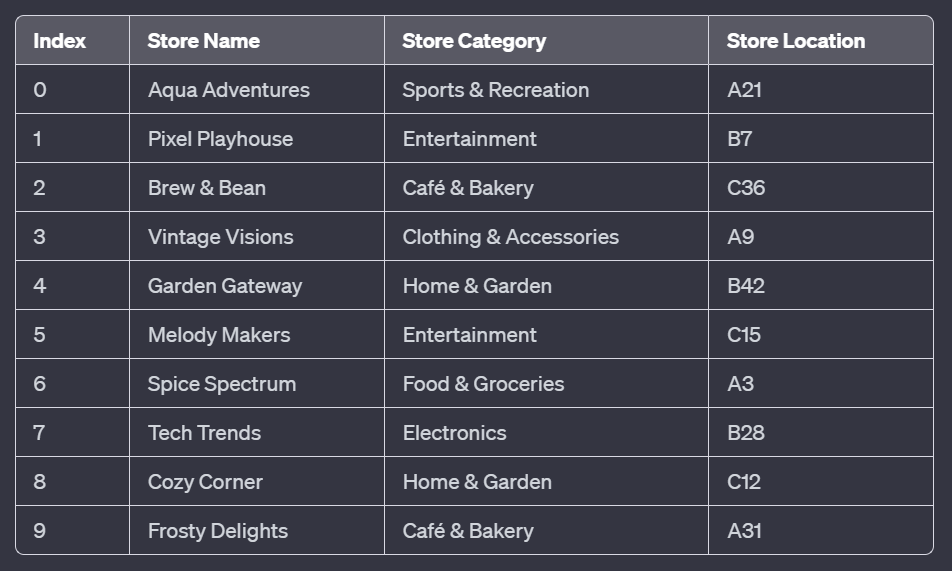

# Required Code for the Assignment



## Program.cs

```csharp

// Global Variables
    // Declare the global arrays
    static string[] storeDirectory;
    static string[] storeCategories;
    static Store[] stores;

    // Populate the arrays in the preload method
    static void Preload()
    {
        storeDirectory = new string[]
        {
            "Aqua Adventures",
            "Pixel Playhouse",
            "Brew & Bean",
            "Vintage Visions",
            "Garden Gateway",
            "Melody Makers",
            "Spice Spectrum",
            "Tech Trends",
            "Cozy Corner",
            "Frosty Delights"
        };

        storeCategories = new string[]
        {
            "Sports & Recreation",      // Aqua Adventures
            "Entertainment",            // Pixel Playhouse
            "Café & Bakery",            // Brew & Bean
            "Clothing & Accessories",   // Vintage Visions
            "Home & Garden",            // Garden Gateway
            "Entertainment",            // Melody Makers
            "Food & Groceries",         // Spice Spectrum
            "Electronics",              // Tech Trends
            "Home & Garden",            // Cozy Corner
            "Café & Bakery"             // Frosty Delights
        };

        stores = new Store[]
        {
            new Store("Aqua Adventures", "Sports & Recreation", "A21"),
            new Store("Pixel Playhouse", "Entertainment", "B7"),
            new Store("Brew & Bean", "Café & Bakery", "C36"),
            new Store("Vintage Visions", "Clothing & Accessories", "A9"),
            new Store("Garden Gateway", "Home & Garden", "B42"),
            new Store("Melody Makers", "Entertainment", "C15"),
            new Store("Spice Spectrum", "Food & Groceries", "A3"),
            new Store("Tech Trends", "Electronics", "B28"),
            new Store("Cozy Corner", "Home & Garden", "C12"),
            new Store("Frosty Delights", "Café & Bakery", "A31")
        };

    } // End Preload

    public static void TestCode() {
    
    
    }


```

Test your code
```csharp
public static void Main(string[] args) {
    Preload();

    Console.WriteLine("Contains");
    Console.WriteLine(ContainsStore(storeDirectory, "Aqua Adventures").ToString()); // True
    Console.WriteLine(ContainsStore(storeDirectory, "Box Lunch").ToString()); // False

    Console.WriteLine("Store By Index");
    Console.WriteLine(StoreByCategory(storeCategories, "Entertainment").ToString()); // 1
    Console.WriteLine(StoreByCategory(storeCategories, "Food").ToString()); // -1

    Console.WriteLine("All stores of a category");
    Console.WriteLine(AllStoresOfACategory(storeCategories, "Café & Bakery").Count); // 2
    Console.WriteLine(AllStoresOfACategory(storeCategories, "Food").Count); // 0

    Console.WriteLine("All stores on a floor");
    List<Store> storeResults = AllStoresOnLevel(stores, "A");
    Console.WriteLine(storeResults.Count); // 4
    foreach(Store store in storeResults) { Console.WriteLine($"{store.Name} - {store.StoreLocation}"); }
    Console.WriteLine(AllStoresOnLevel(stores, "E").Count); // 0
}

```

## Store.cs

```csharp

public class Store
{
    public string Name { get; set; }
    public string Category { get; set; }
    public string StoreLocation { get; set; }

    public Store(string name, string category, string storeLocation)
    {
        Name = name;
        Category = category;
        StoreLocation = storeLocation;
    }
}

```

